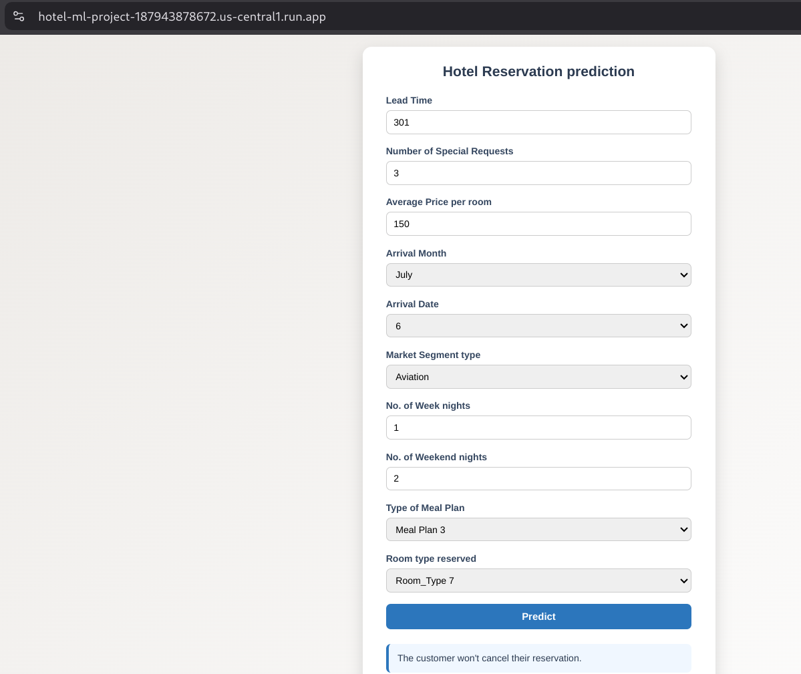

# Hotel Cancellation Prediction - MLOps Pipeline

This project delivers a comprehensive, production-grade MLOps solution designed to predict hotel booking cancellations with high accuracy, leveraging the power of the LightGBM gradient boosting framework. It integrates a fully automated end-to-end machine learning pipeline that seamlessly orchestrates data ingestion, preprocessing, model training, evaluation, and deployment. The MLOps architecture emphasizes continuous integration and continuous deployment (CI/CD) through automated pipelines built with Jenkins, ensuring rapid and reliable updates to the model and application. Containerization with Docker guarantees consistent environments across development, testing, and production, while serverless deployment on Google Cloud Platform (GCP)—specifically using Google Container Registry (GCR) for image storage and Google Cloud Run for scalable hosting—enables effortless scalability and accessibility. This project not only focuses on predictive performance but also on operational excellence, making it a robust, reproducible, and maintainable system for real-world deployment scenarios.
## 🌐 Live Application

**Deployed App**: [https://hotel-ml-project-187943878672.us-central1.run.app/](https://hotel-ml-project-187943878672.us-central1.run.app/)

**Note**: The live application is temporarily unavailable due to GCP charges. However, the codebase is fully functional and can be run locally or redeployed.

## 📸 Project Screenshots

### Deployed Application Interface


### Complete ML Training Pipeline


## 🏗️ Architecture Overview

This project implements a production-ready MLOps pipeline with the following components:

- **Machine Learning**: LightGBM model for hotel cancellation prediction
- **CI/CD Pipeline**: Jenkins with Docker-in-Docker (DinD) setup
- **Containerization**: Docker for application packaging
- **Cloud Infrastructure**: Google Cloud Platform (GCP)
- **Container Registry**: Google Container Registry (GCR)
- **Deployment**: Google Cloud Run for serverless hosting
- **Experiment Tracking**: MLflow for model versioning and metrics
- **Data Storage**: GCP Cloud Storage buckets

## 🚀 Key Features

### MLOps Implementation
- ✅ Automated model training pipeline
- ✅ Model versioning with MLflow
- ✅ Automated testing and validation
- ✅ Containerized deployment
- ✅ CI/CD integration with Jenkins
- ✅ Cloud-native deployment

### Infrastructure as Code
- ✅ Docker containerization
- ✅ Jenkins pipeline automation
- ✅ GCP cloud deployment
- ✅ Scalable serverless architecture

## 📁 Project Structure

```
.
├── assets/                    # Project screenshots and images
│   ├── deployed-app-screenshot.png
│   └── training-pipeline-screenshot.png
├── application.py              # Flask web application
├── pipeline/
│   └── training_pipeline.py   # End-to-end ML pipeline
├── src/                       # Core ML modules
│   ├── data_injestion.py      # Data loading and splitting
│   ├── data_preprocessing.py  # Feature engineering
│   └── model_training.py      # Model training with MLflow
├── config/                    # Configuration management
│   ├── config.yaml           # Model hyperparameters
│   ├── model_params.py       # Parameter definitions
│   └── paths_config.py       # File path configurations
├── artifacts/                 # ML artifacts storage
│   ├── models/               # Trained models
│   ├── processed/            # Processed datasets
│   └── raw/                  # Raw data
├── templates/                 # Web UI templates
├── static/                    # Static assets
├── Dockerfile                 # Container definition
├── Jenkinsfile               # CI/CD pipeline
├── requirements.txt          # Python dependencies
└── mlruns/                   # MLflow experiment tracking
```

## 🛠️ Technology Stack

### Machine Learning
- **Framework**: Python 3.11
- **Algorithm**: LightGBM (Gradient Boosting)
- **Data Processing**: Pandas, NumPy
- **Model Tracking**: MLflow

### DevOps & Infrastructure
- **Containerization**: Docker
- **CI/CD**: Jenkins with Docker-in-Docker (DinD)
- **Cloud Platform**: Google Cloud Platform (GCP)
- **Container Registry**: Google Container Registry (GCR)
- **Deployment**: Google Cloud Run
- **Web Framework**: Flask

### Development
- **Language**: Python 3.11
- **Package Management**: pip, setuptools
- **Configuration**: YAML-based configuration management

## 🔧 Setup Instructions

### Prerequisites
- Docker installed
- Jenkins with DinD capability
- GCP account with required APIs enabled
- Git repository access

### Local Development Setup

1. **Clone the repository**
   ```bash
   git clone https://github.com/your-username/Hotel_Cancellation_Prediction.git
   cd Hotel_Cancellation_Prediction
   ```

2. **Create virtual environment**
   ```bash
   python -m venv venv
   source venv/bin/activate  # On Windows: venv\Scripts\activate
   ```

3. **Install dependencies**
   ```bash
   pip install --upgrade pip
   pip install -e .
   ```

4. **Run the training pipeline**
   ```bash
   python pipeline/training_pipeline.py
   ```

5. **Start the web application**
   ```bash
   python application.py
   ```

### Docker Deployment

1. **Build Docker image**
   ```bash
   cd custom_jenkins
   docker build -t jenkins-dind -f Dockerfile.jenkins .
   cd ..
   docker run -d --name jenkins-dind --user root --privileged --dns=8.8.8.8 --dns=1.1.1.1 -p 8081:8080 -p 50000:50000 -v /var/run/docker.sock:/var/run/docker.sock -v jenkins_home:/var/jenkins_home jenkins-dind
   ```

2. **Run container**
   ```bash
   docker run -p 5000:5000 hotel-ml-project
   ```

3. **Open browser localhost:8081**
   - Access Jenkins UI at `http://localhost:8081`
   - Configure Jenkins with required plugins and credentials
   - Set up the pipeline using the provided `Jenkinsfile`, provide GitHub access token with proper repo permissions, and GCP service account key for deployment.
   - Also make sure to update the SCM configuration in the Jenkinsfile to point to your GitHub repository.

4. **Deploy to GCP**
   - Ensure GCP SDK is installed and configured
   - Authenticate with GCP using service account key
   - Push Docker image to Google Container Registry
   - Deploy to Google Cloud Run using the Jenkins pipeline

5. **Access the application**
   - Once deployed, access the application at the provided Cloud Run URL.

## 🔄 CI/CD Pipeline

### Jenkins Pipeline Overview

The Jenkins pipeline (`Jenkinsfile`) implements a complete CI/CD workflow:

1. **Source Code Management**
   - Clones repository from GitHub
   - Authenticates using GitHub tokens

2. **Environment Setup**
   - Creates Python virtual environment
   - Installs project dependencies
   - Starts Docker daemon (DinD)

3. **Model Training & Validation**
   - Executes ML training pipeline
   - Validates model performance
   - Stores artifacts

4. **Containerization**
   - Builds Docker image
   - Pushes to Google Container Registry (GCR)

5. **Cloud Deployment**
   - Deploys to Google Cloud Run
   - Configures auto-scaling and load balancing

### Pipeline Configuration

```yaml
Environment Variables:
- VENV_DIR: 'venv'
- GCP_PROJECT: "your-gcp-project-id"
- GCLOUD_PATH: "/var/jenkins_home/google-cloud-sdk/bin"
```

### Required Jenkins Credentials
- GitHub access token for repository access
- GCP service account key for cloud deployment

## ☁️ Google Cloud Platform Integration

### Services Used

1. **Google Container Registry (GCR)**
   - Stores Docker images
   - Manages image versions
   - Integrates with Cloud Run

2. **Google Cloud Run**
   - Serverless container deployment
   - Auto-scaling capabilities
   - HTTP endpoint exposure

3. **Google Cloud Storage** (Configured)
   - Raw data storage
   - Model artifacts backup
   - Experiment logs

### GCP Setup Requirements

1. **Enable APIs**
   ```bash
   gcloud services enable run.googleapis.com
   gcloud services enable containerregistry.googleapis.com
   ```

2. **Configure Authentication**
   ```bash
   gcloud auth configure-docker
   gcloud config set project YOUR_PROJECT_ID
   gcloud auth activate-service-account --key-file=path/to/your/service-account-key.json
   ```

## 📊 MLflow Integration

### Experiment Tracking
- **Model Metrics**: Accuracy, Precision, Recall, F1-Score
- **Parameter Logging**: Hyperparameters and configurations
- **Artifact Storage**: Model files and preprocessing objects
- **Model Registry**: Version control for production models

### MLflow UI Access
```bash
mlflow ui --host 0.0.0.0 --port 5000
```

## 🐳 Docker Configuration

### Multi-stage Build Process
1. **Base Image**: Python 3.11
2. **Dependencies**: System packages and Python libraries
3. **Application**: Source code and configuration
4. **Training**: Automated model training during build
5. **Runtime**: Flask web server on port 5000

#### DinD Configuration
The dockerfile for external docker-in-docker (DinD) setup is configured to allow Jenkins to build and run Docker containers within the Jenkins environment. This setup is crucial for CI/CD pipelines that require containerization.

The custom_jenkins/Dockerfile is designed to run Jenkins with Docker capabilities, enabling the execution of Docker commands within the Jenkins pipeline. It includes necessary configurations for user permissions, volume mounts, and network settings to ensure seamless integration with the host Docker daemon.

Whereas the dockerfile for the application is designed to run the Flask application with the trained model.

### Docker Features
- Optimized for production deployment
- Automated model training during build
- Health checks and monitoring ready
- Minimal attack surface

## 🔒 Security & Best Practices

### Security Measures
- Service account-based GCP authentication
- Encrypted credential storage in Jenkins
- Minimal container privileges
- Network security groups

### MLOps Best Practices
- Automated testing in CI pipeline
- Monitoring and alerting setup

## 📈 Monitoring & Logging

### Application Logs
- Structured logging with timestamps
- Request/response tracking
- Error monitoring and alerting

### Model Performance Monitoring
- Prediction drift detection
- Model accuracy tracking
- Business metrics monitoring

## 🚀 Deployment Architecture

```
GitHub Repository
       ↓
Jenkins CI/CD Pipeline
       ↓
Docker Image Build
       ↓
Google Container Registry
       ↓
Google Cloud Run Deployment
       ↓
Production HTTP Endpoint
```

## 📝 Configuration Management

### Environment Configuration
- Development, staging, and production configs
- YAML-based parameter management
- Environment-specific model parameters

## 🆘 Troubleshooting

### Common Issues

1. **Docker Build Failures**
   - Check Docker daemon status
   - Verify system dependencies

2. **GCP Deployment Issues**
   - Verify service account permissions
   - Check GCP project configuration
   - Increase timeout for image push to Google cloud repository
   - Validate container registry access

3. **Jenkins Pipeline Failures**
   - Verify credentials configuration
   - Check DinD setup
   - Update GIDs for docker, jenkins as per your sys requirement , alongwith the 8080 default port.
   - Cross validate ports, and provide access to jenkins user inside the conatiner to your `host` docker socket
   - Make sure to mount your volumes for docker conatiners to persist updates.
   - Review pipeline logs
